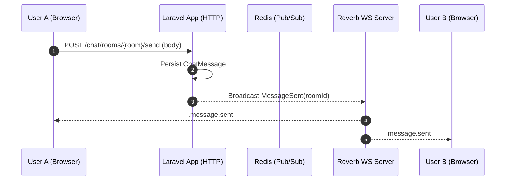

# Article 7 — Building a Real-Time Chat Application with Laravel & WebSockets

Outcome: Build a usable real-time chat with presence, typing indicators, and read receipts using Laravel 11, Reverb (first‑party WebSockets), and Laravel Echo.

## What You’ll Build
A simple, multi-room chat where authenticated users can join a room, see who’s online, send messages instantly, and view message read status. This demonstrates persistent WebSocket connections and event-driven UI updates.

## Prerequisites
- PHP 8.2+
- Composer
- Node.js 18+
- Redis 6+ (for broadcasting/backplane and session/cache)
- Laravel 11.x
- Optional: Docker Desktop for local Redis

## Technology Choices
- **Laravel Reverb**: First-party WebSockets server introduced by Laravel. Production-ready and tightly integrated.
- **Laravel Echo**: Client library to subscribe to channels and listen to broadcast events.
- **Redis**: Pub/Sub backplane so multiple app instances share WebSocket events.
- **Octane** (optional here): Improves throughput; we note specific considerations.

## Architecture Overview
- HTTP requests handle authentication, room navigation, and message posting endpoints.
- Broadcastable events are emitted on message creation, typing, and read receipts.
- Reverb pushes these events to browser clients subscribed via Echo.

High-level event flow
1. User posts message via HTTP endpoint
2. Controller persists message
3. `MessageSent` event is broadcast to `presence-chat.{roomId}`
4. Echo client receives event and updates UI instantly

## Project Setup
```bash
# Create a new app
composer create-project laravel/laravel chat-app
cd chat-app

# Install Reverb (Laravel's WebSocket server)
php artisan install:broadcasting
php artisan reverb:install --force

# Install frontend dependencies
npm install

# Start Redis (local)
docker run -p 6379:6379 --name redis -d redis:7-alpine || true

# Copy .env
cp .env.example .env
php artisan key:generate
```

Update `.env` for broadcasting with Reverb and Redis:
```env
BROADCAST_CONNECTION=reverb
CACHE_STORE=redis
QUEUE_CONNECTION=redis
SESSION_DRIVER=redis

REVERB_APP_ID=local
REVERB_APP_KEY=local
REVERB_APP_SECRET=local
REVERB_HOST=127.0.0.1
REVERB_PORT=8080
REVERB_SCHEME=http
REVERB_SERVER_HOST=127.0.0.1
REVERB_SERVER_PORT=8080
REVERB_REDIS_TLS=false
```

Start services during development in separate terminals:
```bash
php artisan reverb:start
php artisan serve
npm run dev
```

## Domain Modeling
We will keep it minimal but realistic:
- `rooms` table for chat rooms
- `messages` table for chat messages
- `ChatRoom`, `ChatMessage` models
- Events: `MessageSent`, `UserTyping`, `MessageRead`
- Broadcast channels: `presence-chat.{roomId}`

### Migrations
```php
// database/migrations/2024_01_01_000000_create_rooms_table.php
use Illuminate\Database\Migrations\Migration;
use Illuminate\Database\Schema\Blueprint;
use Illuminate\Support\Facades\Schema;

return new class extends Migration {
    public function up(): void {
        Schema::create('rooms', function (Blueprint $table) {
            $table->id();
            $table->string('name');
            $table->timestamps();
        });
    }
    public function down(): void {
        Schema::dropIfExists('rooms');
    }
};
```
```php
// database/migrations/2024_01_01_000001_create_messages_table.php
use Illuminate\Database\Migrations\Migration;
use Illuminate\Database\Schema\Blueprint;
use Illuminate\Support\Facades\Schema;

return new class extends Migration {
    public function up(): void {
        Schema::create('messages', function (Blueprint $table) {
            $table->id();
            $table->foreignId('room_id')->constrained('rooms')->cascadeOnDelete();
            $table->foreignId('user_id')->constrained('users')->cascadeOnDelete();
            $table->text('body');
            $table->timestamp('read_at')->nullable();
            $table->timestamps();
        });
    }
    public function down(): void {
        Schema::dropIfExists('messages');
    }
};
```

### Models
```php
// app/Models/ChatRoom.php
namespace App\Models;

use Illuminate\Database\Eloquent\Factories\HasFactory;
use Illuminate\Database\Eloquent\Model;
use Illuminate\Database\Eloquent\Relations\HasMany;

class ChatRoom extends Model
{
    use HasFactory;

    protected $fillable = ['name'];

    public function messages(): HasMany
    {
        return $this->hasMany(ChatMessage::class, 'room_id');
    }
}
```
```php
// app/Models/ChatMessage.php
namespace App\Models;

use Illuminate\Database\Eloquent\Factories\HasFactory;
use Illuminate\Database\Eloquent\Model;
use Illuminate\Database\Eloquent\Relations\BelongsTo;

class ChatMessage extends Model
{
    use HasFactory;

    protected $fillable = ['room_id', 'user_id', 'body', 'read_at'];

    public function room(): BelongsTo
    {
        return $this->belongsTo(ChatRoom::class, 'room_id');
    }

    public function user(): BelongsTo
    {
        return $this->belongsTo(User::class);
    }
}
```

## Broadcasting Events
```php
// app/Events/MessageSent.php
namespace App\Events;

use App\Models\ChatMessage;
use Illuminate\Broadcasting\Channel;
use Illuminate\Broadcasting\InteractsWithSockets;
use Illuminate\Broadcasting\PresenceChannel;
use Illuminate\Contracts\Broadcasting\ShouldBroadcast;
use Illuminate\Queue\SerializesModels;

class MessageSent implements ShouldBroadcast
{
    use InteractsWithSockets, SerializesModels;

    public function __construct(public ChatMessage $message) {}

    public function broadcastOn(): Channel
    {
        return new PresenceChannel('chat.' . $this->message->room_id);
    }

    public function broadcastAs(): string
    {
        return 'message.sent';
    }

    public function broadcastWith(): array
    {
        return [
            'id' => $this->message->id,
            'room_id' => $this->message->room_id,
            'user' => [
                'id' => $this->message->user->id,
                'name' => $this->message->user->name,
            ],
            'body' => $this->message->body,
            'created_at' => $this->message->created_at->toIso8601String(),
        ];
    }
}
```

Typing and read events (optional, analogous):
```php
// app/Events/UserTyping.php
namespace App\Events;

use Illuminate\Broadcasting\InteractsWithSockets;
use Illuminate\Broadcasting\PresenceChannel;
use Illuminate\Contracts\Broadcasting\ShouldBroadcast;
use Illuminate\Queue\SerializesModels;

class UserTyping implements ShouldBroadcast
{
    use InteractsWithSockets, SerializesModels;

    public function __construct(public int $roomId, public int $userId, public bool $isTyping) {}

    public function broadcastOn(): PresenceChannel { return new PresenceChannel('chat.' . $this->roomId); }
    public function broadcastAs(): string { return 'user.typing'; }
    public function broadcastWith(): array { return ['user_id' => $this->userId, 'is_typing' => $this->isTyping]; }
}
```
```php
// app/Events/MessageRead.php
namespace App\Events;

use Illuminate\Broadcasting\InteractsWithSockets;
use Illuminate\Broadcasting\PresenceChannel;
use Illuminate\Contracts\Broadcasting\ShouldBroadcast;
use Illuminate\Queue\SerializesModels;

class MessageRead implements ShouldBroadcast
{
    use InteractsWithSockets, SerializesModels;

    public function __construct(public int $roomId, public int $messageId, public int $userId) {}

    public function broadcastOn(): PresenceChannel { return new PresenceChannel('chat.' . $this->roomId); }
    public function broadcastAs(): string { return 'message.read'; }
    public function broadcastWith(): array { return ['message_id' => $this->messageId, 'user_id' => $this->userId]; }
}
```

## Channel Authorization
Define who can join a room presence channel in `routes/channels.php`:
```php
use App\Models\ChatRoom;
use Illuminate\Support\Facades\Broadcast;

Broadcast::channel('chat.{roomId}', function ($user, int $roomId) {
    return ChatRoom::query()->whereKey($roomId)->exists()
        ? ['id' => $user->id, 'name' => $user->name]
        : false;
});
```

## Controllers and Routes
```php
// app/Http/Controllers/ChatController.php
namespace App\Http\Controllers;

use App\Events\MessageRead;
use App\Events\MessageSent;
use App\Events\UserTyping;
use App\Models\ChatMessage;
use App\Models\ChatRoom;
use Illuminate\Http\Request;
use Illuminate\Support\Facades\Auth;

class ChatController extends Controller
{
    public function index()
    {
        $rooms = ChatRoom::query()->orderBy('name')->get();
        return view('chat.index', compact('rooms'));
    }

    public function room(ChatRoom $room)
    {
        $messages = $room->messages()->with('user')->latest()->limit(50)->get()->reverse()->values();
        return view('chat.room', compact('room', 'messages'));
    }

    public function send(Request $request, ChatRoom $room)
    {
        $validated = $request->validate(['body' => ['required', 'string', 'max:2000']]);
        $message = ChatMessage::create([
            'room_id' => $room->id,
            'user_id' => Auth::id(),
            'body' => $validated['body'],
        ]);
        $message->load('user');
        broadcast(new MessageSent($message))->toOthers();
        return response()->json(['ok' => true, 'message' => $message]);
    }

    public function typing(Request $request, ChatRoom $room)
    {
        $validated = $request->validate(['is_typing' => ['required', 'boolean']]);
        broadcast(new UserTyping($room->id, Auth::id(), $validated['is_typing']))->toOthers();
        return response()->noContent();
    }

    public function read(Request $request, ChatRoom $room, ChatMessage $message)
    {
        if ($message->room_id !== $room->id) {
            abort(404);
        }
        $message->update(['read_at' => now()]);
        broadcast(new MessageRead($room->id, $message->id, Auth::id()))->toOthers();
        return response()->noContent();
    }
}
```
```php
// routes/web.php
use App\Http\Controllers\ChatController;
use Illuminate\Support\Facades\Route;

Route::middleware('auth')->group(function () {
    Route::get('/chat', [ChatController::class, 'index'])->name('chat.index');
    Route::get('/chat/rooms/{room}', [ChatController::class, 'room'])->name('chat.room');
    Route::post('/chat/rooms/{room}/send', [ChatController::class, 'send'])->name('chat.send');
    Route::post('/chat/rooms/{room}/typing', [ChatController::class, 'typing'])->name('chat.typing');
    Route::post('/chat/rooms/{room}/messages/{message}/read', [ChatController::class, 'read'])->name('chat.read');
});
```

## Frontend: Laravel Echo + Reverb
Install Echo and Pusher protocol client:
```bash
npm install laravel-echo pusher-js
```

Bootstrap Echo in `resources/js/bootstrap.js`:
```js
import Echo from 'laravel-echo';
import Pusher from 'pusher-js';

window.Pusher = Pusher;

window.Echo = new Echo({
  broadcaster: 'reverb',
  key: import.meta.env.VITE_REVERB_APP_KEY,
  wsHost: import.meta.env.VITE_REVERB_HOST ?? window.location.hostname,
  wsPort: import.meta.env.VITE_REVERB_PORT ?? 8080,
  wssPort: import.meta.env.VITE_REVERB_PORT ?? 8080,
  forceTLS: false,
  enabledTransports: ['ws', 'wss'],
});
```

Add Vite env variables in `.env`:
```env
VITE_REVERB_APP_KEY=${REVERB_APP_KEY}
VITE_REVERB_HOST=${REVERB_HOST}
VITE_REVERB_PORT=${REVERB_PORT}
```

### Blade UI
```php
// resources/views/chat/room.blade.php
@extends('layouts.app')
@section('content')
<div class="container">
  <h1 class="mb-3">Room: {{ $room->name }}</h1>
  <div id="messages" class="border rounded p-3 mb-3" style="height: 50vh; overflow-y: auto;">
    @foreach ($messages as $msg)
      <div class="mb-2">
        <strong>{{ $msg->user->name }}:</strong>
        <span>{{ $msg->body }}</span>
        <small class="text-muted">{{ $msg->created_at->diffForHumans() }}</small>
      </div>
    @endforeach
  </div>
  <form id="send-form" class="d-flex gap-2">
    <input type="text" id="message-input" class="form-control" placeholder="Type a message..." maxlength="2000" />
    <button class="btn btn-primary" type="submit">Send</button>
  </form>
  <div id="typing" class="mt-2 text-muted" style="min-height:1.5rem"></div>
</div>
@endsection
@push('scripts')
<script type="module">
import './resources/js/bootstrap.js';

const roomId = {{ $room->id }};
const userId = {{ auth()->id() }};
const messagesEl = document.getElementById('messages');
const inputEl = document.getElementById('message-input');
const formEl = document.getElementById('send-form');
const typingEl = document.getElementById('typing');
let typingTimeout = null;

window.Echo.join(`chat.${roomId}`)
  .here(users => { /* optionally render online users */ })
  .joining(user => { /* show user joined */ })
  .leaving(user => { /* show user left */ })
  .listen('.message.sent', (e) => {
    const div = document.createElement('div');
    div.className = 'mb-2';
    div.innerHTML = `<strong>${e.user.name}:</strong> <span>${e.body}</span> <small class="text-muted">just now</small>`;
    messagesEl.appendChild(div);
    messagesEl.scrollTop = messagesEl.scrollHeight;
  })
  .listen('.user.typing', (e) => {
    if (e.user_id === userId) return;
    typingEl.textContent = e.is_typing ? 'Someone is typing…' : '';
  })
  .listen('.message.read', (e) => {
    // Optionally mark message as read in UI
  });

formEl.addEventListener('submit', async (ev) => {
  ev.preventDefault();
  const body = inputEl.value.trim();
  if (!body) return;
  await fetch(`{{ route('chat.send', $room) }}`, {
    method: 'POST',
    headers: { 'Content-Type': 'application/json', 'X-CSRF-TOKEN': '{{ csrf_token() }}' },
    body: JSON.stringify({ body })
  });
  inputEl.value = '';
});

inputEl.addEventListener('input', async () => {
  clearTimeout(typingTimeout);
  await fetch(`{{ route('chat.typing', $room) }}`, {
    method: 'POST', headers: { 'Content-Type': 'application/json', 'X-CSRF-TOKEN': '{{ csrf_token() }}' },
    body: JSON.stringify({ is_typing: true })
  });
  typingTimeout = setTimeout(async () => {
    await fetch(`{{ route('chat.typing', $room) }}`, {
      method: 'POST', headers: { 'Content-Type': 'application/json', 'X-CSRF-TOKEN': '{{ csrf_token() }}' },
      body: JSON.stringify({ is_typing: false })
    });
  }, 1200);
});
</script>
@endpush
```

## Running It
- Start Redis, Reverb, PHP server, and Vite as shown
- Visit `/chat/rooms/{id}` in two browsers (or incognito) after creating rooms and logging in
- Send messages; they should appear instantly on both clients

Seeder snippet to create rooms quickly:
```php
// database/seeders/RoomSeeder.php
public function run(): void { \App\Models\ChatRoom::factory()->create(['name' => 'General']); }
```

## Octane Considerations (Optional for this app)
- Use Redis for sessions/cache; do not keep request data in singletons
- If you enable Octane, set sensible `--max-requests` and memory limits, and avoid static state in listeners

## Troubleshooting
- Events not received: confirm `reverb:start` is running, Echo connects (network tab), proper channel name, and `BROADCAST_CONNECTION=reverb`
- 403 joins: check `routes/channels.php` return value and authentication
- Mixed content: if using HTTPS for app but WS is `ws://`, configure TLS or proxy
- Redis errors: ensure Redis is running and `.env` uses `redis` driver for broadcasting backplane

## Extensions
- Direct messages (private channels per user pair)
- File attachments
- Message editing and deletion with audit logs
- Message search with Meilisearch/Scout

## Commit-by-Commit Walkthrough (for students)
- Commit 1: Project skeleton, Reverb install, `.env` broadcasting, Redis up
- Commit 2: Migrations for rooms and messages; models with relations
- Commit 3: Events `MessageSent`, `UserTyping`, `MessageRead`
- Commit 4: Channel authorization for `presence-chat.{roomId}`
- Commit 5: Controller actions and routes for index/room/send/typing/read
- Commit 6: Frontend dependencies, Echo bootstrap, Vite env
- Commit 7: Blade UI for room with real-time updates
- Commit 8: Seeder, QA notes, troubleshooting, and docs

Each commit should include a README snippet explaining why the change was needed, trade-offs, and how to test it locally.

## Diagrams



