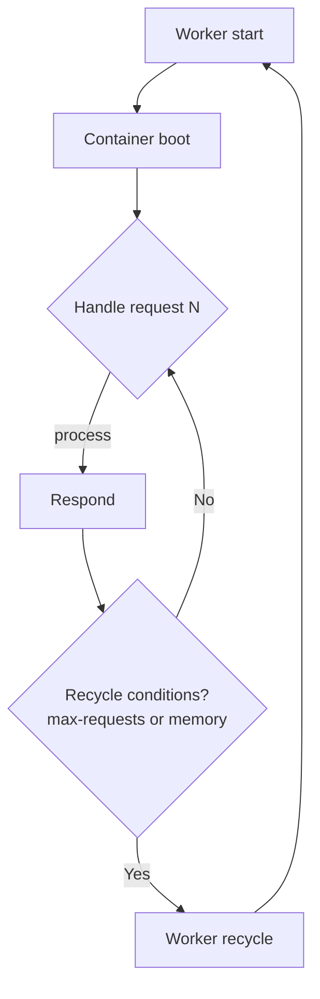

# Article 8 — Advanced Memory Management & Debugging in a Stateful World (Octane)

Outcome: Become an Octane expert at avoiding and finding memory leaks. Understand worker lifecycles, common pitfalls, safe patterns, and how to profile and fix leaks.

## Why Memory Management Matters in Octane
Laravel Octane runs long-lived workers. Anything you put into global/static state or application singletons can persist across requests. That yields speed, but also memory leaks and cross-request contamination if misused.

## Key Concepts
- Request vs Worker lifetime: Request data must not leak into worker context
- Container bindings: `singleton`, `scoped`, `bind`
- Resetting state: Octane can purge/resume workers, but it’s your job to keep state disciplined
- Opcache vs memory pool: Opcache caches code, not request data

## Rules of Thumb
- Do not cache Request/User/Response instances in `singleton` services
- Prefer `scoped()` bindings for request-bound services
- Clear large in-memory caches periodically or use Redis
- Avoid unbounded arrays and static caches that grow forever
- Use streaming/chunked processing for large datasets

## Worker Lifecycle Cheatsheet
- Start: container is booted once
- Handle requests: same worker handles many requests
- Recycle: based on `--max-requests`, memory thresholds, or manual reload

## Detecting Leaks Fast
- Watch memory in production: process RSS and PHP memory usage
- Use Octane commands: `php artisan octane:status`
- Add metrics: log peak memory per request and aggregate by route

```php
// app/Http/Middleware/TrackMemory.php
namespace App\Http\Middleware;

use Closure;
use Illuminate\Http\Request;
use Illuminate\Support\Facades\Log;

class TrackMemory
{
    public function handle(Request $request, Closure $next)
    {
        $before = memory_get_usage(true);
        $peakBefore = memory_get_peak_usage(true);
        $response = $next($request);
        $after = memory_get_usage(true);
        $peakAfter = memory_get_peak_usage(true);
        Log::info('memory', [
            'route' => $request->path(),
            'before' => $before,
            'after' => $after,
            'delta' => $after - $before,
            'peak_delta' => $peakAfter - $peakBefore,
        ]);
        return $response;
    }
}
```
Register this middleware temporarily for suspect routes.

## Classic Leak Patterns (With Fixes)

### 1) Accidental global cache growth
```php
// Bad: grows forever across requests
class UserCache {
    public static array $byId = [];
}

// Controller
UserCache::$byId[$userId] = $user; // never cleared
```
Fix: Use Redis or LRU cache with a hard cap, or scope to request.

### 2) Singletons holding request objects
```php
// Bad
$this->app->singleton(ReportGenerator::class, function ($app) {
    return new ReportGenerator(request()); // captures Request forever
});
```
Fix: `scoped()` or inject only the data needed.
```php
$this->app->scoped(ReportGenerator::class, function ($app) {
    return new ReportGenerator(request()->user()->id);
});
```

### 3) Event listeners capturing heavy closures
```php
// Bad: closure captures large arrays from first request
Event::listen('data.ready', function () use ($hugeArray) { /* ... */ });
```
Fix: Extract to invokable listener class; do not capture large references.

### 4) Static properties as caches without eviction
Fix: Either set a max size and eviction policy or avoid entirely.

### 5) Large collections kept in memory
Fix: use chunking/streaming
```php
User::query()->chunk(1000, function ($chunk) { /* process */ });
```

## Octane-Specific Tools
- `--max-requests=500` or similar to recycle workers
- Memory limit guards via Supervisor/systemd (kill and restart on overuse)
- `Octane::purge()` to drop singleton state between jobs (use sparingly)
- `Octane::concurrently()` for parallel I/O without growing memory

```php
use Laravel\Octane\Facades\Octane;

[$user, $orders, $invoices] = Octane::concurrently([
    fn () => User::find($id),
    fn () => Order::where('user_id', $id)->latest()->limit(10)->get(),
    fn () => Invoice::where('user_id', $id)->latest()->limit(10)->get(),
]);
```

## Profiling and Debugging
- Local profiling: Xdebug (profile mode), XHProf/Tideways, Blackfire
- Production-safe sampling: OpenTelemetry exporters, StatsD, custom logs

Xdebug quickstart (local):
- Enable `xdebug.mode=profile`
- Run a few requests; open output in QCacheGrind/KCacheGrind
- Look for high allocation paths and long-lived arrays

Blackfire/Tideways: instrument selected routes under load; diff before/after changes.

## Safe Service Design Patterns
- Constructor accepts IDs/scalars, not Request/models
- Idempotent services that do not store internal mutable state between calls
- Short-lived caches with explicit `clear()` and max size
- Use `->scoped()` bindings for request-lifetime services

```php
// AppServiceProvider
public function register(): void
{
    $this->app->scoped(\App\Services\ReportGenerator::class, function ($app) {
        return new \App\Services\ReportGenerator(auth()->id());
    });
}
```

## Guardrails and CI Checks
- Static analysis to flag `request()` usage inside singletons
- Unit tests that simulate multiple requests on the same service instance
- A smoke test that loops a route 5k times and asserts memory stays bounded

```php
public function test_memory_does_not_grow_unbounded(): void
{
    $memory = 0;
    for ($i = 0; $i < 5000; $i++) {
        $this->get('/reports');
        if ($i % 100 === 0) {
            $current = memory_get_usage(true);
            $this->assertLessThan($memory + 5 * 1024 * 1024, $current); // +5MB tolerance
            $memory = $current;
        }
    }
}
```

## Operations Playbook
- Start workers with conservative `--max-requests`
- Monitor RSS and restart when exceeding threshold
- Use rolling restarts to avoid traffic drops
- Keep per-worker memory headroom for bursts

Supervisor example:
```ini
[program:octane]
command=php artisan octane:start --server=swoole --workers=8 --task-workers=8 --max-requests=500
numprocs=1
autostart=true
autorestart=true
stdout_logfile=/var/log/octane.out.log
stderr_logfile=/var/log/octane.err.log
stopwaitsecs=60
```

## Checklist (Paste into PRs)
- No request objects in singletons
- No static caches without caps/eviction
- Big arrays processed with chunking/streams
- Memory tracked per route
- Workers recycled with sensible limits

## Commit-by-Commit Teaching Plan
- Commit 1: Add middleware to log memory usage per request; docs on reading logs
- Commit 2: Demonstrate a leak with a static cache; show growth graphs
- Commit 3: Refactor to `scoped()` bindings and external cache (Redis)
- Commit 4: Add profiling setup (Xdebug/Blackfire) with screenshots and steps
- Commit 5: Introduce CI smoke test to guard against regressions
- Commit 6: Add Supervisor/systemd configs and operational guidance

Each commit message should include “What changed”, “Why”, “How to verify”, “Rollout/rollback plan”.

## Diagrams



