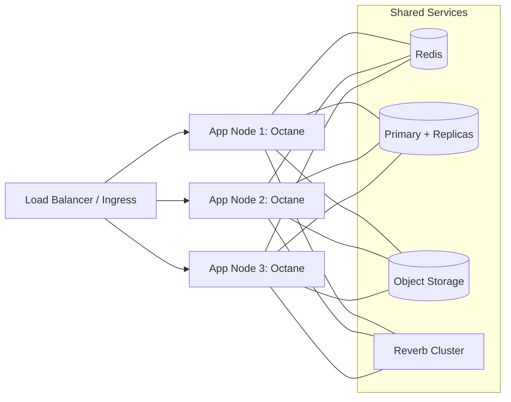

# Article 9 — Scaling Your Octane Application: Load Balancing and Multi-Server Setups

Outcome: Build a clear, actionable strategy to scale your Octane app horizontally with confidence. Learn load balancer configs, sticky sessions, broadcasting across nodes, and zero-downtime deploys.

## Scaling Overview
- Scale up: bigger servers, more CPU/RAM
- Scale out (preferred): multiple app instances behind a load balancer
- Octane specifics: long-lived workers need careful deploy/restart strategies

## Core Building Blocks
- Load balancer: Nginx, HAProxy, AWS ALB, GCP LB, Cloudflare
- Shared state: Redis for sessions/cache/queues, S3 for files
- Database: primary + read replicas
- Broadcasting: Reverb with Redis backplane so all nodes receive events

## Reference Topology
- Nginx/ALB terminates TLS and balances to N app servers
- Each app server runs Octane (Swoole/RoadRunner) and connects to shared Redis/DB
- Reverb runs collocated or separately; uses Redis for inter-node events
- Queue workers run on the same or dedicated nodes

## Load Balancer Configs

### Nginx (reverse proxy)
```nginx
upstream app_upstream {
    server 10.0.1.10:8000 max_fails=3 fail_timeout=30s;
    server 10.0.1.11:8000 max_fails=3 fail_timeout=30s;
    keepalive 64;
}

server {
    listen 80;
    server_name example.com;

    location /healthz { return 200 'ok'; add_header Content-Type text/plain; }

    location / {
        proxy_pass http://app_upstream;
        proxy_http_version 1.1;
        proxy_set_header Host $host;
        proxy_set_header X-Real-IP $remote_addr;
        proxy_set_header X-Forwarded-For $proxy_add_x_forwarded_for;
        proxy_set_header X-Forwarded-Proto $scheme;
    }
}
```

### HAProxy (sticky sessions example)
```haproxy
frontend fe_http
  bind *:80
  default_backend be_app

backend be_app
  balance roundrobin
  cookie SRV insert indirect nocache
  server app1 10.0.1.10:8000 check cookie s1
  server app2 10.0.1.11:8000 check cookie s2
```

## Octane Service Management
Systemd service example:
```ini
[Unit]
Description=Laravel Octane
After=network.target

[Service]
Type=simple
User=www-data
WorkingDirectory=/var/www/app
ExecStart=/usr/bin/php artisan octane:start --server=swoole --workers=8 --task-workers=8 --max-requests=500 --watch
ExecStop=/usr/bin/php artisan octane:stop
Restart=always
RestartSec=5
Environment=APP_ENV=production

[Install]
WantedBy=multi-user.target
```

Rolling restarts (zero-downtime):
- Remove instance from LB
- `systemctl reload octane` or stop/start
- Run migrations (if safe)
- Warm caches
- Add back to LB
- Repeat for next instance

## Sessions and Sticky Sessions
- Store sessions in Redis
- Prefer stateless auth (tokens) when possible
- If you must use cookies + sessions, sticky sessions at LB level can reduce cross-node misses

`.env` snippet:
```env
SESSION_DRIVER=redis
CACHE_STORE=redis
QUEUE_CONNECTION=redis
BROADCAST_CONNECTION=reverb
```

## Broadcasting Across Nodes (Reverb + Redis)
- Ensure all nodes point to the same Redis for broadcasting
- Use presence/private channels for auth
- Reverb can run on each node; LB can route WS traffic or you can dedicate hosts

Nginx WS pass-through:
```nginx
location /app/* {
    proxy_pass http://reverb_upstream;
    proxy_http_version 1.1;
    proxy_set_header Upgrade $http_upgrade;
    proxy_set_header Connection "Upgrade";
    proxy_set_header Host $host;
}
```

## Queues and Background Jobs
- Run `php artisan queue:work` on multiple nodes
- Use `--max-jobs` and `--max-time` to recycle
- Prefer Horizon for monitoring and balancing

Horizon snippet (supervisor):
```ini
[program:horizon]
command=php artisan horizon
numprocs=1
autostart=true
autorestart=true
stdout_logfile=/var/log/horizon.out.log
stderr_logfile=/var/log/horizon.err.log
```

## Database Scaling
- Read replicas for reporting/feeds; use `->useReadPdo()` or read/write connections
- Migrate carefully; prefer backward-compatible schema changes
- Add indexes as traffic grows; measure via slow query logs

## File Storage
- Use S3 or compatible blob storage for user uploads
- Serve via CDN; never depend on local disk sharing across instances

## Health Checks and Readiness
- `/healthz` endpoint returns 200 and optionally checks Redis/DB
- LB removes failing nodes automatically
- Use connection draining before shutdown

## Observability
- Centralized logs (ELK, Loki)
- Metrics (Prometheus/Grafana, CloudWatch) for request rate, errors, latency, memory, CPU
- Tracing (OpenTelemetry) to analyze cross-service performance

## Docker/Kubernetes Notes
- Docker: one container per process (app, horizon, reverb). Compose example:
```yaml
version: '3.8'
services:
  app:
    build: .
    command: php artisan octane:start --server=swoole --host=0.0.0.0 --port=8000 --workers=8 --task-workers=8 --max-requests=500
    ports: ["8000:8000"]
    env_file: .env
    depends_on: [redis, db]
  reverb:
    build: .
    command: php artisan reverb:start --host=0.0.0.0 --port=8080
    ports: ["8080:8080"]
    env_file: .env
    depends_on: [redis]
  redis:
    image: redis:7-alpine
    ports: ["6379:6379"]
  db:
    image: mysql:8
    environment:
      MYSQL_DATABASE: app
      MYSQL_ROOT_PASSWORD: secret
    ports: ["3306:3306"]
```
- Kubernetes: use Deployments with rolling updates; readiness/liveness probes; ConfigMaps/Secrets for env; Services for app and Reverb; HPA for scaling

## Runbooks
- Scale out: add node, register with LB, deploy, warm, add to rotation
- Incident: spike in latency → check DB/Redis saturation → scale horizontally → increase workers temporarily
- WebSockets outage: verify Reverb health and Redis connectivity

## Cost and Performance Tips
- Tune `workers` and `task-workers` to CPU cores
- Set `--max-requests` to recycle workers and cap memory growth
- Cache config/routes/views; preload frequent data if safe

## Commit-by-Commit Teaching Plan
- Commit 1: Introduce Nginx or ALB config; add health checks
- Commit 2: Move sessions/cache/queue to Redis; document reasons
- Commit 3: Add Reverb with Redis backplane, WS proxy config
- Commit 4: Add Supervisor/systemd units for Octane/Horizon; rolling restart procedure
- Commit 5: Add Docker Compose (and optional K8s notes) for local multi-instance testing
- Commit 6: Add observability dashboard pointers and SLOs

Each commit should include verification steps: how to test LB routing, sticky sessions, broadcast across two nodes, and zero-downtime rollout.

## Diagrams



